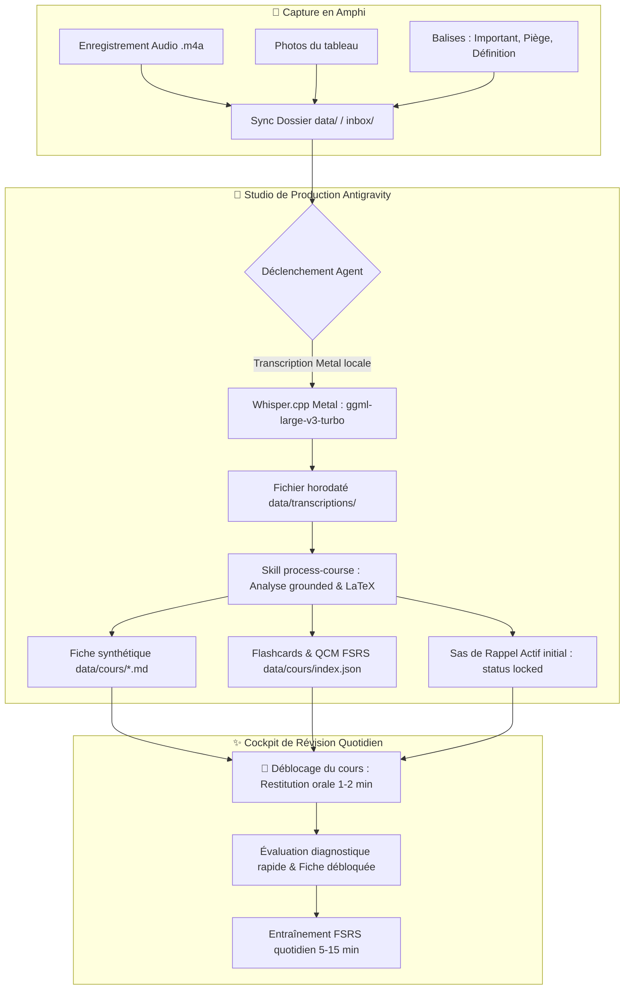

# Pipeline & Workflow — Cours (Studio Antigravity & Cockpit)

Ce document décrit le fonctionnement du flux de travail complet de **Cours** (BioMIA Revision OS), articulé entre le **Studio Antigravity** (orchestration et compilation intelligente) et le **Cockpit Cours** (révisions actives quotidiennes sur Mac et Mobile).

---

## 1. Architecture Globale : Studio vs Cockpit



---

## 2. Compétences Antigravity (Skills)

| Skill | Déclencheur naturel | Rôle & Action |
| :--- | :--- | :--- |
| **`process-course`** | *"Fais le cours de BioCell"*, *"Traite les enregistrements en attente"* | Détecte les audios/inbox, lance Whisper Metal, génère la fiche Markdown, extrait les pièges d'examen, crée les flashcards FSRS et initialise le sas de rappel actif. |
| **`oral-tutor`** | *"Passe-moi un oral blanc sur le chapitre 2"*, *"Interroge-moi sur la thermo"* | Mène une simulation d'interrogation orale socratique (5, 15 ou 30 min) et fournit un bilan diagnostique complet noté sur 100. |

---

## 3. Commandes Utiles (Helper CLI)

Le script `scripts/course-helper.mjs` fournit des utilitaires rapides pour l'agent et l'utilisateur :

### 1. Lister les enregistrements et cours en attente :
```bash
node scripts/course-helper.mjs pending
```

### 2. Lancer la transcription Whisper Metal locale :
```bash
node scripts/course-helper.mjs transcribe data/enregistrements/<audio-file>.m4a
```

### 3. Valider la conformité des cours et des flashcards :
```bash
node scripts/course-helper.mjs validate [courseId]
```

### 4. Lancer le serveur backend :
```bash
node server.mjs
```
*(Ou en ouvrant directement l'application `/Applications/Cours.app`)*

